# 🔐 Trace 1.0 - Authentication & Desktop Agent Security Architecture

This document provides a complete deep-dive into the **Dual-Authentication Architecture**, **Desktop Agent Security Protocol**, and the **Shift Sweep Background Cron Engine** implemented in Trace 1.0.

---

## 📊 1. Dual-Authentication & Shift Sweep Flowchart

```mermaid
flowchart TD
    subgraph Web_Auth ["1. Web Dashboard (Admin/Manager)"]
        A["User Login (email + password)"] --> B["jwtAuth Middleware: Authorization: Bearer <jwt>"]
        B --> C["Decodes JWT & Verifies company.isActive in DB"]
        C --> D["Grants Admin Dashboard Access"]
    end

    subgraph Agent_Auth ["2. Desktop Electron Agent"]
        E["Desktop Agent App"] --> F["agentAuth Middleware: x-agent-token Header"]
        F --> G["Looks up User by agentToken in DB"]
        G --> H{"Check user.isActive & company.isActive"}
        H -- Inactive/Deactivated --> I["Return 403 Forbidden / Revoke Access"]
        H -- Active --> J["Attach req.agentUser & Allow Route"]
        J --> K["POST /api/agent/heartbeat (Every 30s)"]
    end

    subgraph Shift_Sweep ["3. Background System Engine (shiftSweep.ts)"]
        L["Shift Sweep Cron (Runs every 60s)"] --> M["Find Shifts where endTime is NULL"]
        M --> N{"Is now - lastHeartbeatAt > gracePeriod (90m)?"}
        N -- Yes --> O["Auto-close Shift (checkoutType: heartbeat_timeout)"]
        O --> P["Recompute Total Work Hours & Broadcast SSE clock_out"]
        N -- No --> Q["Keep Shift Active"]
    end
```



---

## 🔑 2. The Dual-Authentication Model (Why 2 Auth Systems?)

Trace 1.0 separates web frontend requests from desktop client requests.

| Auth System | Used By | Header Format | Token Type | Lifetime & Revocation |
| :--- | :--- | :--- | :--- | :--- |
| **`jwtAuth`** | React / Next.js Admin Dashboard | `Authorization: Bearer <token>` | Signed JWT (HMAC SHA-256) | Expire in 7 Days. Contains `userId`, `companyId`, `role`. |
| **`agentAuth`** | Electron Desktop Agent App | `x-agent-token: <unique-token>` | Database API Key (`User.agentToken`) | **Persistent / Long-lived**. Revocable instantly by Admin via 1-click token regeneration! |

### Why doesn't the Desktop Agent use standard 7-day JWTs?
1. **Background Service Continuity:** Desktop agents run quietly in the OS background. Having them log out every 7 days due to an expired JWT would disrupt automated time tracking.
2. **Instant Admin Revocation:** With a JWT, if an employee is terminated, their token remains valid until it expires. With `agentAuth`, the middleware queries the DB (`user.isActive` & `company.isActive`) on **every agent call**, so an admin can terminate access in 0 milliseconds!

---

## 🛠️ 3. Code Deep-Dive: `agentAuth` Middleware

**File:** `src/middleware/agentAuth.ts`

```typescript
export async function agentAuth(req: Request, res: Response, next: NextFunction) {
  const token = req.headers['x-agent-token'] as string | undefined;

  if (!token) {
    return res.status(401).json({ error: 'Missing x-agent-token header' });
  }

  // 1. Fetch user by persistent agentToken
  const user = await prisma.user.findUnique({
    where: { agentToken: token },
    include: { company: { select: { id: true, isActive: true } } },
  });

  // 2. Validate User & Company Status
  if (!user) return res.status(401).json({ error: 'Invalid agent token' });
  if (!user.isActive) return res.status(403).json({ error: 'User account is deactivated' });
  if (!user.company.isActive) return res.status(403).json({ error: 'Company account is suspended' });

  // 3. Attach scoped agent user to Request
  req.agentUser = {
    userId: user.id,
    companyId: user.companyId,
    teamId: user.teamId,
    role: user.role,
    email: user.email,
    name: user.name,
  };

  next();
}
```

---

## ⏱️ 4. The Agent Shift Lifecycle (Clock-In $\rightarrow$ Heartbeat $\rightarrow$ Disconnect)

**File:** `src/routes/agent.routes.ts`

```
1. POST /api/agent/clock-in   ---> Creates Shift record (startTime = now, endTime = null)
2. POST /api/agent/heartbeat  ---> Updates lastHeartbeatAt = now (Sent every 30s)
3. POST /api/agent/screenshot ---> Uploads base64 screenshot to Cloudflare R2
4. POST /api/agent/app-usage  ---> Syncs application activity batch
5. POST /api/agent/clock-out  ---> User manually clicks "Stop Shift" (calculates total work secs)
6. POST /api/agent/disconnect ---> Electron catches OS shutdown/power-cut intent
```

---

## 🧹 5. Shift Sweep Cron Engine (`shiftSweep.ts`)

### Problem:
What happens if an employee's computer experiences a power-cut, internet crash, or abrupt OS failure? The agent cannot send a `clock-out` request, leaving the shift stuck open in the database forever!

### Solution: Background Sweeper
**File:** `src/cron/shiftSweep.ts`

The server runs a background job every 60 seconds (`SWEEP_INTERVAL_MS = 60_000`):

```typescript
export function startShiftSweep() {
  setInterval(async () => {
    // 1. Find all active shifts (endTime is NULL)
    const staleCandidates = await prisma.shift.findMany({
      where: { endTime: null, lastHeartbeatAt: { not: null } },
      include: { company: { include: { settings: true } } }
    });

    const now = new Date();

    for (const shift of staleCandidates) {
      // Default grace period: 90 minutes (5400s)
      const graceSecs = shift.company.settings?.heartbeatGraceSecs ?? 5400;
      const isStale = (now.getTime() - shift.lastHeartbeatAt.getTime()) > (graceSecs * 1000);

      if (isStale) {
        // 2. Determine effective end time (disconnect intent or last heartbeat)
        const effectiveEndTime = shift.disconnectAt ?? shift.lastHeartbeatAt;

        // 3. Force-close active shift
        await prisma.shift.update({
          where: { id: shift.id },
          data: {
            endTime: effectiveEndTime,
            checkoutType: 'heartbeat_timeout',
          }
        });

        // 4. Recompute exact work totals
        const updatedShift = await computeShiftTotals(shift.id);

        // 5. Broadcast to SSE Admin Dashboard
        sseManager.broadcast(shift.companyId, 'shift.clock_out', {
          userId: shift.userId,
          shiftId: shift.id,
          endTime: effectiveEndTime,
          checkoutType: 'heartbeat_timeout',
        });
      }
    }
  }, 60_000);
}
```

---

## 🎯 6. Summary Matrix

| Concept | File | Responsibility |
| :--- | :--- | :--- |
| **Web Auth** | `jwtAuth.ts` | Authenticates Admin/Manager HTTP requests via JWT |
| **Agent Auth** | `agentAuth.ts` | Authenticates Electron Agent API calls via `x-agent-token` |
| **Shift Engine** | `agent.controller.ts` | Manages clock-in, clock-out, idle time, and screenshots |
| **Stale Cleanup** | `shiftSweep.ts` | Auto-closes abandoned shifts after 90m heartbeat timeout |
| **Audit Logging** | `audit.service.ts` | Records security & system actions (`shift.auto_checkout`) |
