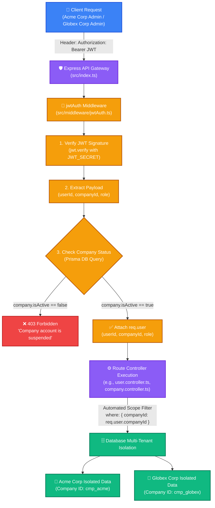

# 🔐 Trace 1.0 - Authentication & Multi-Tenant Architecture

This document provides an in-depth breakdown of the **Authentication System** (JWT, Password Hashing, Role-Based Access Control) and the **Multi-Tenant Architecture** (Data Isolation by `companyId`) implemented in Trace 1.0.

---

## 🫧 1. Multi-Tenant & Auth Bubble Diagram



---

## 🔑 2. Authentication Pipeline Deep-Dive

Trace 1.0 uses stateless **JSON Web Tokens (JWT)** for all Web Dashboard users (Admins and Managers).

### A. Password Security (`bcrypt`)
* User passwords are **never stored as plain text**.
* During registration (`/api/auth/company/register` or `/api/auth/user/login`), passwords are hashed using `bcrypt` with a salt factor of 10.

### B. JWT Structure (`signJwt`)
When a user logs in, the server signs a JWT containing the user's scope:
```typescript
interface JwtPayload {
  userId: string;
  companyId: string;
  role: 'admin' | 'manager' | 'employee';
  type: 'company' | 'user';
}
```
* **Secret Key:** Signed with `JWT_SECRET` from environment variables.
* **Expiration:** Standard validity of 7 days (`604800` seconds).

---

## 🛡️ 3. Middleware Security & Role Enforcement

### A. Authentication Middleware (`jwtAuth.ts`)
`jwtAuth` intercepts every protected request to perform 3 security checks:
1. **Header Validation:** Ensures `Authorization: Bearer <token>` is present.
2. **Signature Verification:** Calls `jwt.verify(token, JWT_SECRET)`.
3. **Live Tenant Check:** Queries Prisma DB to verify `company.isActive === true`. If the company has been suspended (e.g. unpaid invoice), it immediately blocks access with `403 Forbidden`.

```typescript
// Sets req.user for downstream controllers
req.user = {
  userId: decoded.userId,
  companyId: decoded.companyId,
  role: decoded.role,
  type: decoded.type,
};
```

### B. Role-Based Access Control (`requireRole`)
Factory middleware that restricts routes based on permissions:
```typescript
// Example: Only Admins can modify company settings or delete users
router.patch('/company', jwtAuth, requireRole('admin'), updateCompany);
```

---

## 🏢 4. Multi-Tenant Architecture (Data Isolation Strategy)

### What is Multi-Tenancy in B2B SaaS?
Multi-tenancy means multiple companies (tenants) share the exact same database and server infrastructure, but **neither company can ever see or access another company's data**.

### How Trace 1.0 Enforces Multi-Tenant Isolation:

1. **Foreign Key Attachment (`companyId`):**
   Every single table in Prisma (`User`, `Team`, `Shift`, `Screenshot`, `AppUsage`, `Settings`) has a required `companyId` foreign key.

2. **Automatic Scope Injection:**
   Because `jwtAuth` extracts `req.user.companyId`, controllers **never trust input from the request body** for tenant identification. They always query using `req.user.companyId`:

   ```typescript
   // 🔒 SAFE: Always scoped to authenticated user's company
   const users = await prisma.user.findMany({
     where: { 
       companyId: req.user.companyId // Guarantees zero data leakage!
     }
   });
   ```

3. **Superadmin Exception:**
   Only the Superadmin endpoints (`/api/superadmin/*`) bypass `companyId` scoping to manage the entire platform across all companies.

---

## 🎯 5. Summary Table

| Security Component | Implementation File | Purpose |
| :--- | :--- | :--- |
| **Password Hashing** | `auth.controller.ts` | Salts and hashes passwords via `bcrypt` |
| **JWT Verification** | `jwtAuth.ts` | Verifies bearer token signature and active company status |
| **Role Guarding** | `requireRole(...)` | Restricts endpoints to `admin` or `manager` roles |
| **Tenant Isolation** | All Controllers | Enforces `where: { companyId }` on all Prisma database queries |

---

## 🛠️ 6. Deep-Dive: Auth Controller Concepts & Security Algorithms

### A. Key Helper Concepts Explained

1. **`logAudit` (Audit Trail Logging):**
   * Imported from `src/services/audit.service.ts`.
   * Records administrative and security events (e.g. `company.registered`, `company.login`, `user.login`) in an immutable `AuditLog` database table for security compliance and tracking who did what.

2. **Slug Generation (`generateCompanySlug`):**
   * Converts company name to lowercase, replaces spaces and special characters with hyphens (`-`).
   * Runs a `while` loop checking Prisma DB for uniqueness. If `acme-corp` exists, it generates `acme-corp-2`, `acme-corp-3`, etc.

3. **`tx` (Prisma Database Transaction):**
   * `tx` is the Transaction Client passed inside `prisma.$transaction(async (tx) => { ... })`.
   * Enforces **ACID (All-or-Nothing)** execution: When registering a company, 3 operations (Create Company $\rightarrow$ Create Default Settings $\rightarrow$ Create Admin User) must all succeed together. If creating the Admin fails, `tx` automatically rolls back the Company creation so orphan rows are never left in DB.

4. **`signJwt` (JWT Token Signer):**
   * Helper function in `src/middleware/jwtAuth.ts` that wraps `jsonwebtoken.sign()`.
   * Signs `userId`, `companyId`, `role`, and `type` with `JWT_SECRET` for a 7-day expiration period.

5. **`companyId` vs `companySlug` Dual Lookup:**
   * `loginUser` accepts either `companyId` or `companySlug`.
   * Allows flexibility for different clients: Web Frontend uses URL slug (e.g. `trace.com/login/acme`), while mobile/desktop APIs pass `companyId`.

6. **Public vs Private Company Endpoints:**
   * **`GET /api/auth/companies` (Public):** Unauthenticated dropdown list used on user login pages. Returns basic public company names/slugs.
   * **`GET /api/company` (Private):** Authenticated via `jwtAuth`. Returns private dashboard metrics, trial status, and employee limits for the logged-in company.

---

### B. Security Algorithms (Step-by-Step Execution Rules)

#### 1. Company Registration Algorithm (`registerCompany`)
- **Step 1:** Convert company name into a unique URL-friendly slug.
- **Step 2:** Hash the raw password using `bcrypt` (12 salt rounds).
- **Step 3:** Calculate trial expiration date (Current Date + 30 days).
- **Step 4:** Execute DB Transaction (`tx`):
  - Insert new `Company` row.
  - Insert default `CompanySettings` row linked to company ID.
  - Insert initial `Admin User` row with generated 32-byte `agentToken`.
- **Step 5:** Sign a 7-day JWT token with `role = 'admin'` and `type = 'company'`.
- **Step 6:** Write an immutable audit log (`action = 'company.registered'`).
- **Step 7:** Return HTTP `201 Created` with JWT token, company info, and admin user data.

#### 2. Company Login Algorithm (`loginCompany`)
- **Step 1:** Look up company by `email`. If not found $\rightarrow$ return `401 Invalid email or password`.
- **Step 2:** Compare raw `password` against DB `company.passwordHash` via `bcrypt.compare()`. If invalid $\rightarrow$ return `401 Invalid email or password`.
- **Step 3:** Check `company.isActive`. If false $\rightarrow$ return `403 Company account is suspended`.
- **Step 4:** Locate active Admin User for this company.
- **Step 5:** Sign JWT token with `role = 'admin'`.
- **Step 6:** Write audit log (`action = 'company.login'`).
- **Step 7:** Return HTTP `200 OK` with JWT token and company metadata.

#### 3. User Login Algorithm (`loginUser`)
- **Step 1:** Look up company by `companyId` (or fallback to `companySlug`). If not found $\rightarrow$ return `401 Invalid company or credentials`.
- **Step 2:** Check `company.isActive`. If false $\rightarrow$ return `403 Company account is suspended`.
- **Step 3:** Look up user by composite key `(companyId + email)`. If user not found OR `user.isActive` is false $\rightarrow$ return `401 Invalid company or credentials`.
- **Step 4:** Compare raw `password` against DB `user.passwordHash` via `bcrypt.compare()`. If invalid $\rightarrow$ return `401 Invalid company or credentials`.
- **Step 5:** Sign JWT token with `userId`, `companyId`, and `user.role`.
- **Step 6:** Write audit log (`action = 'user.login'`).
- **Step 7:** Return HTTP `200 OK` with JWT token, user details, and company details.

