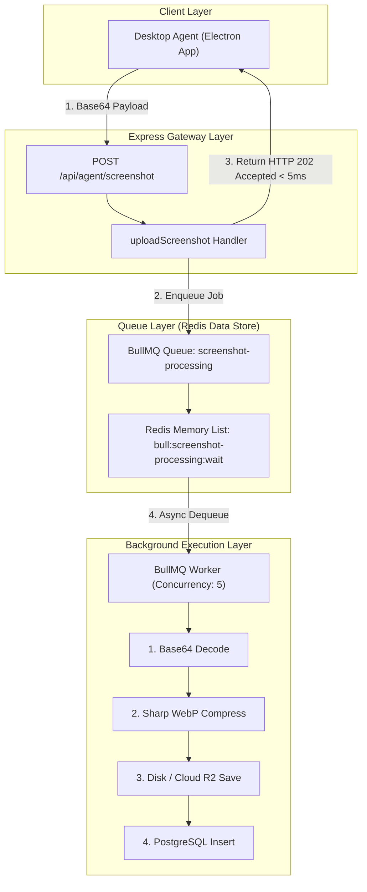

# Background Job Queue Architecture (BullMQ + Redis)

## 1. System Overview & Problem Statement

In Trace 1.0, desktop agent clients upload high-resolution base64 encoded screenshots every 60 seconds.

### The Synchronous Bottleneck (Without Queue)
Processing screenshots synchronously inside the Express HTTP request handler introduces a critical performance bottleneck:

1. **CPU Intensive Operations:** Decoding a 2MB-5MB base64 string into binary buffers and running image compression executes C++ bindings directly on the main V8 JavaScript thread.
2. **Event Loop Starvation:** While V8 executes image compression algorithms, the Node.js single-threaded Event Loop cannot process any incoming HTTP requests for other users.
3. **High Latency & Timeouts:** Processing a single screenshot takes between 800ms and 2,000ms. If 20 desktop agents send screenshots simultaneously at the same second, response latency spikes to 10+ seconds, causing HTTP 504 gateway timeouts.

### The Asynchronous Queue Solution (BullMQ + Redis)
By decoupling request reception from payload processing using BullMQ and Redis:

1. Express receives the request, pushes a small job payload into Redis RAM, and returns `HTTP 202 Accepted` in **< 5ms**.
2. A separate background worker thread consumes jobs from Redis asynchronously, handling image compression and database insertion at a controlled concurrency rate without blocking web traffic.

---

## 2. Visual Architecture Diagram



---

## 3. Algorithmic Code Logic (Simple Pseudocode)

### A. Queue Producer (`screenshotQueue`)

```javascript
// Step 1: Initialize Redis Connection
redis = Connect("redis://localhost:6379")

// Step 2: Create BullMQ Queue
queue = CreateQueue("screenshot-processing", redis, retries = 3)

// Step 3: Enqueue Function
function addScreenshotJob(payload) {
    return queue.add("process-screenshot", payload)
}
```

---

### B. Lightweight Express Controller (`agent.controller`)

```javascript
function uploadScreenshot(request, response) {
    // 1. Verify shift
    shift = GetActiveShift(request.userId)

    // 2. Push payload to Redis Queue (< 3ms)
    job = addScreenshotJob({ userId, companyId, shiftId, base64Image })

    // 3. Return Instant Response (< 5ms)
    return response.send(status = 202, message = "Queued", jobId = job.id)
}
```

---

### C. Asynchronous Worker Consumer (`screenshotWorker`)

```javascript
// Worker listens on queue with 5 parallel threads
worker = CreateWorker("screenshot-processing", redis, concurrency = 5, async (job) => {
    // 1. Extract payload
    { base64Image, userId, companyId, shiftId } = job.data

    // 2. Process image
    rawBuffer = DecodeBase64(base64Image)
    compressedWebP = CompressSharp(rawBuffer, quality = 80)

    // 3. Save to storage
    storageKey = SaveToDiskOrR2(compressedWebP)

    // 4. Save to Database
    return Database.Insert("screenshots", { userId, shiftId, storageKey })
})
```

---

## 4. Algorithmic Step-by-Step Execution Pipeline

1. **Client Payload Dispatch:** Desktop Agent sends HTTP POST with Base64 screenshot.
2. **Express Reception & Validation:** Express verifies agent authentication and active shift.
3. **Redis Job Enqueue:** Controller calls `addScreenshotJob()`, pushing job to Redis list `bull:screenshot-processing:wait`.
4. **Instant HTTP 202 Handshake:** Express returns `HTTP 202 Accepted` to client in `< 5ms`.
5. **Event Notification & Dequeue:** BullMQ Worker detects job in Redis and pulls payload.
6. **Binary Decoding & WebP Compression:** Worker decodes base64 string and compresses image to WebP format.
7. **Storage & DB Persistence:** Worker writes file to storage (Disk/R2) and creates DB record in PostgreSQL.
8. **Job Completion & Cleanup:** Worker marks job completed in Redis and flushes memory.

---

## 5. Architectural Trade-offs & Engineering Considerations

| Metric / Aspect | Synchronous Direct Processing | Asynchronous BullMQ Queue |
| :--- | :--- | :--- |
| **API Response Time** | 800ms – 2,000ms (High Risk of Timeouts) | **< 5ms (Constant Time O(1))** |
| **Node.js Event Loop Impact** | Severe blocking during image compression | Zero blocking on HTTP server thread |
| **System Stability Under Spikes** | Crashes or returns 504 on traffic spikes | **100% Stable (Redis absorbs traffic spikes)** |
| **Data Consistency Model** | Immediate Consistency | **Eventual Consistency** (Available after ~500ms) |
| **Infrastructure Dependency** | Single Express Node.js Server | Requires Redis In-Memory Data Store |

### Key Engineering Considerations
- **Eventual Consistency:** Dashboard sees screenshot after ~500ms processing delay (100% acceptable for monitoring).
- **Backpressure & Concurrency Control:** `concurrency: 5` processes 5 jobs at a time, buffering 1,000s of incoming requests in RAM without crashing CPU.
- **Payload Size Limits:** Passing large base64 strings in Redis increases RAM usage. Production optimization: Upload raw payload to temp storage URL first, then pass only `storageKey` in BullMQ.
