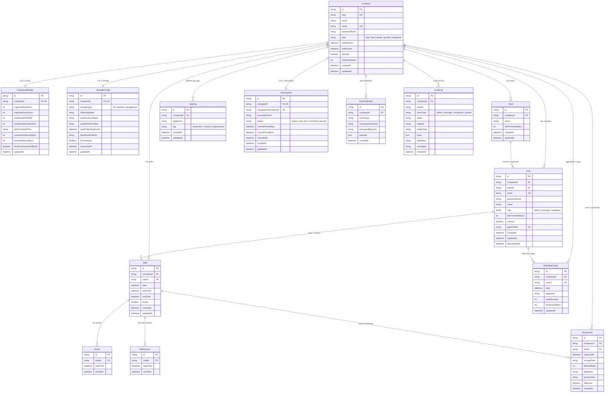

# 🗄️ Trace 1.0 — Entity Relationship Diagram (ERD)

```mermaid
erDiagram

    Company ||--|| CompanySettings : "1-to-1 config"
    Company ||--|| StorageConfig : "1-to-1 storage"
    Company ||--o{ Team : "has teams"
    Company ||--o{ User : "has members"
    Company ||--o{ Shift : "has shifts"
    Company ||--o{ Screenshot : "owns screenshots"
    Company ||--o{ DailyAppUsage : "aggregates usage"
    Company ||--o{ AppTag : "defines app tags"
    Company ||--o| Subscription : "1-to-1 subscription"
    Company ||--o{ PaymentEvent : "logs webhooks"
    Company ||--o{ AuditLog : "audit records"

    Team ||--o{ User : "contains employees"

    User ||--o{ Shift : "clock-in history"
    User ||--o{ DailyAppUsage : "daily app usage"

    Shift ||--o{ Break : "has breaks"
    Shift ||--o{ IdleSession : "has idle sessions"
    Shift ||--o{ Screenshot : "captures telemetry"

    Company {
        string id PK
        string slug UK
        string name
        string email UK
        string passwordHash
        string plan "trial | free | starter | growth | enterprise"
        datetime trialStartsAt
        datetime trialEndsAt
        boolean isActive
        int maxEmployees
        datetime createdAt
        datetime updatedAt
    }

    CompanySettings {
        string id PK
        string companyId FK, UK
        int expectedWorkSecs
        int expectedActiveSecs
        int maxBreaksPerShift
        int maxBreakDurationSecs
        string lateThresholdTime
        int screenshotIntervalSecs
        int heartbeatGraceSecs
        boolean blurScreenshotsOnBreak
        datetime updatedAt
    }

    StorageConfig {
        string id PK
        string companyId FK, UK
        string storageType "r2 | onedrive | googledrive"
        string r2BucketName
        string oauthAccessToken
        string oauthRefreshToken
        datetime oauthTokenExpiresAt
        string driveRootFolderId
        boolean isConnected
        datetime connectedAt
        datetime updatedAt
    }

    Team {
        string id PK
        string companyId FK
        string name
        int idleThresholdSecs
        datetime createdAt
        datetime updatedAt
    }

    User {
        string id PK
        string companyId FK
        string teamId FK
        string email UK
        string passwordHash
        string name
        string role "admin | manager | employee"
        int idleThresholdSecs
        boolean isActive
        string agentToken UK
        datetime createdAt
        datetime updatedAt
        datetime deactivatedAt
    }

    Shift {
        string id PK
        string companyId FK
        string userId FK
        datetime date
        datetime startTime
        datetime endTime
        boolean isLate
        datetime createdAt
        datetime updatedAt
    }

    Break {
        string id PK
        string shiftId FK
        datetime startTime
        datetime endTime
    }

    IdleSession {
        string id PK
        string shiftId FK
        datetime startTime
        datetime endTime
    }

    Screenshot {
        string id PK
        string companyId FK
        string shiftId FK
        datetime capturedAt
        string storagePath
        int fileSizeBytes
        string appName
        string windowTitle
        boolean isBlurred
        datetime createdAt
    }

    DailyAppUsage {
        string id PK
        string companyId FK
        string userId FK
        datetime date
        string appName
        int totalSeconds
        int foregroundSecs
        datetime updatedAt
    }

    AppTag {
        string id PK
        string companyId FK
        string appName
        string tag "productive | neutral | unproductive"
        datetime createdAt
        datetime updatedAt
    }

    Subscription {
        string id PK
        string companyId FK, UK
        string razorpaySubscriptionId UK
        string razorpayPlanId
        string status "active | past_due | canceled | paused"
        datetime currentPeriodStart
        datetime currentPeriodEnd
        datetime canceledAt
        datetime createdAt
        datetime updatedAt
    }

    PaymentEvent {
        string id PK
        string companyId FK
        string eventType
        string razorpayPaymentId
        string razorpaySignature
        json payload
        datetime createdAt
    }

    AuditLog {
        string id PK
        string companyId FK
        string actorId
        string actorType "admin | manager | employee | system"
        string action
        string targetId
        string targetType
        json meta
        string ipAddress
        string userAgent
        datetime createdAt
    }
```
