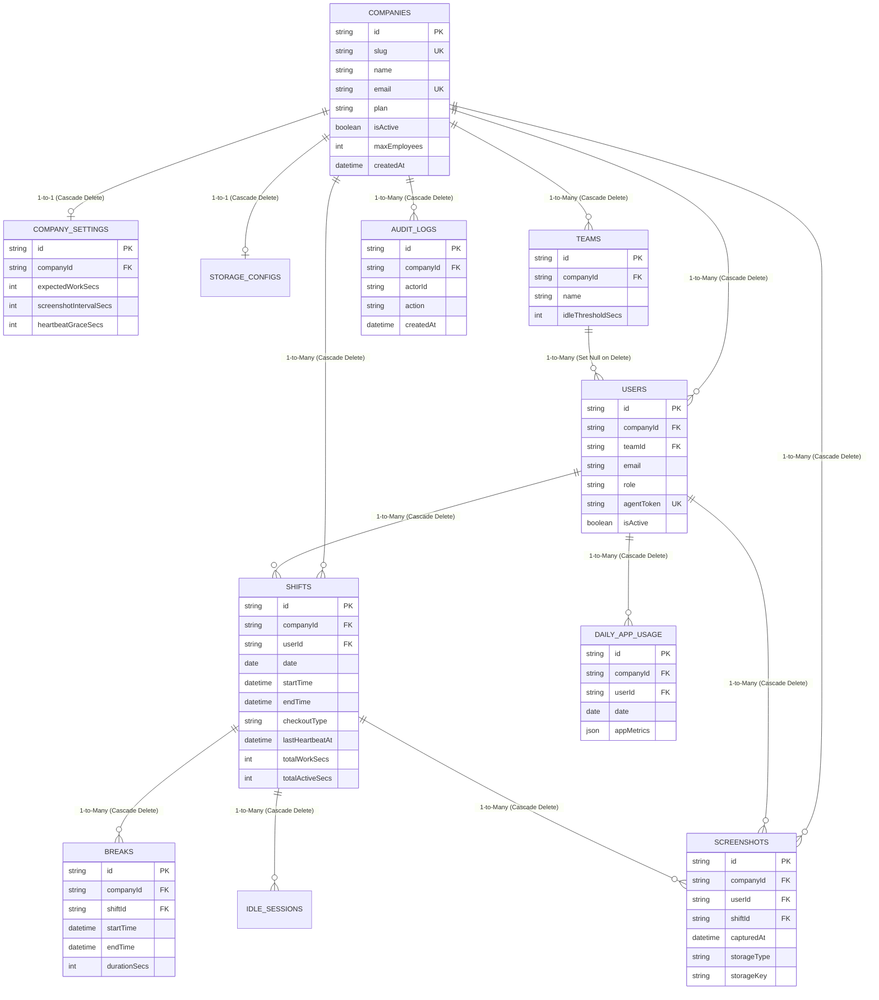

# 🗄️ Trace 1.0 - Database Schema & Relational Model Architecture

This document provides a complete visual and structural breakdown of the **PostgreSQL Multi-Tenant Database Schema** (managed via Prisma ORM), detailing table entities, foreign key relationships, cascade behaviors, and indexing strategies.

---

## 📊 1. Full Entity-Relationship Diagram (ERD)



---

## 🏗️ 2. Core Relational Hierarchy

The database follows a strict 3-tier hierarchy:

$$\text{Company (Tenant Root)} \longrightarrow \text{Teams (Department Grouping)} \longrightarrow \text{Users (Employees/Admins)}$$

```
Company (Root Tenant)
 ├── CompanySettings (1-to-1 Configuration)
 ├── StorageConfig (1-to-1 Cloud Drive Config)
 ├── Teams (1-to-Many Departments)
 │    └── Users (Belong to 0 or 1 Team)
 └── Shifts (1-to-Many Work Sessions)
      ├── Breaks (1-to-Many Pauses)
      ├── IdleSessions (1-to-Many Inactive Windows)
      └── Screenshots (1-to-Many Media Files)
```

---

## 🛡️ 3. Database Integrity & Cascade Deletes

To prevent "orphan" records (e.g. screenshots existing for a deleted user, or breaks existing for a deleted shift), Prisma schema uses explicit **referential integrity actions**:

### A. Cascade Delete (`onDelete: Cascade`)
When a parent record is deleted, PostgreSQL automatically purges all child records in a single database transaction:
* Deleting a `Company` $\rightarrow$ automatically purges its `CompanySettings`, `Teams`, `Users`, `Shifts`, `Screenshots`, and `AuditLogs`.
* Deleting a `Shift` $\rightarrow$ automatically purges all associated `Breaks`, `IdleSessions`, and `Screenshots`.

### B. Set Null (`onDelete: SetNull`)
When a department/team is deleted:
* Deleting a `Team` $\rightarrow$ sets `User.teamId = null`.
* **Why?** An employee should NOT be deleted from the company just because their department/team was renamed or removed!

---

## ⚡ 4. Performance Indexing Strategy (`@@index`)

Without indexes, querying millions of screenshots or shift records for a dashboard would cause full table scans (slow queries). 

Trace 1.0 uses targeted composite indexes:

```prisma
// Fast Daily Dashboard Queries (e.g. Get today's shifts for Company X)
@@index([companyId, date])

// Fast User Activity Timeline (e.g. Get User Y's screenshots for Date Z)
@@index([userId, capturedAt])
@@index([companyId, capturedAt])

// Fast Multi-Tenant Composite Unique Key
@@unique([companyId, email]) // Same email can register under different companies!
```

---

## 🎯 5. Summary Table Matrix

| Table Name | Primary Purpose | Key Foreign Keys | Cascade Rule |
| :--- | :--- | :--- | :--- |
| `companies` | Tenant root table storing plan tier & status | None (Root) | Parent table |
| `company_settings` | Shift thresholds, screenshot frequency | `companyId` | `onDelete: Cascade` |
| `teams` | Grouping employees into departments | `companyId` | `onDelete: Cascade` |
| `users` | Admin & Employee user accounts | `companyId`, `teamId` | Team: `SetNull`, Company: `Cascade` |
| `shifts` | Work sessions logged by Desktop Agent | `companyId`, `userId` | `onDelete: Cascade` |
| `breaks` | Shift pauses logged by Desktop Agent | `companyId`, `shiftId` | `onDelete: Cascade` |
| `screenshots` | Base64 $\rightarrow$ R2 storage keys & metadata | `companyId`, `userId`, `shiftId` | `onDelete: Cascade` |
| `audit_logs` | Immutable security audit trail | `companyId` | `onDelete: Cascade` |
