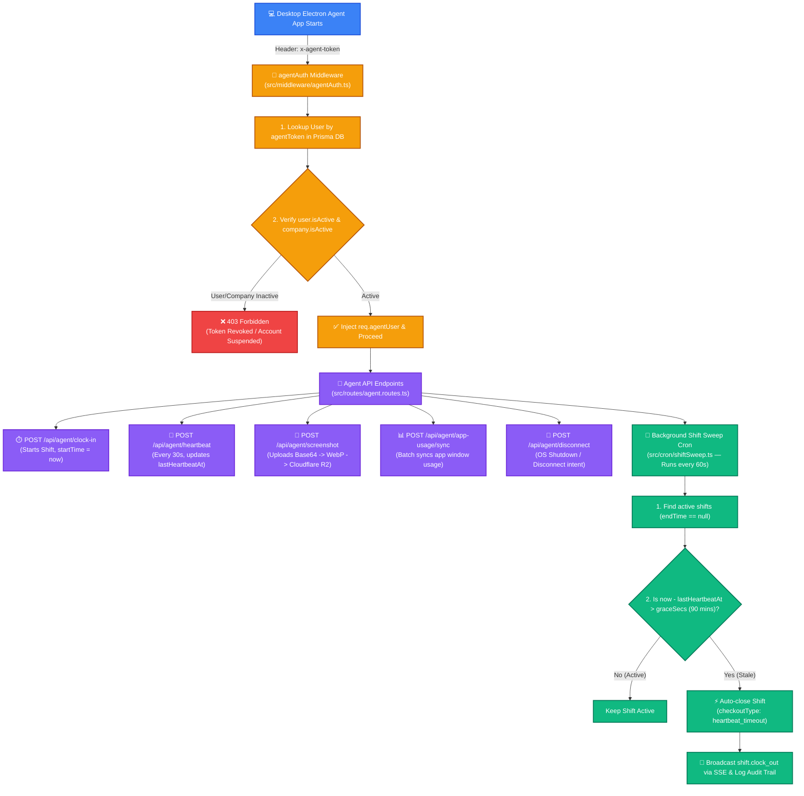

# 🖥️ Trace 1.0 - Desktop Agent Architecture & Shift Engine

This document provides a complete deep-dive into the **Desktop Electron Agent Architecture**, API Key Authentication (`x-agent-token`), Shift Lifecycle Management, and the **Shift Sweep Background Cron Engine**.

---

## 📊 1. Desktop Agent Architecture & Lifecycle Flowchart



---

## 🔑 2. Agent Authentication Protocol (`agentAuth.ts`)

The Desktop Agent runs continuously in the OS background on employee machines.

### Why API Keys (`x-agent-token`) instead of JWTs?
1. **Uninterrupted Background Operations:** A standard 7-day JWT would require employees to manually re-login every week inside the background app, causing lost tracking data.
2. **Instant 0-Millisecond Admin Revocation:** `agentAuth` queries Prisma DB on every API call to verify `user.isActive` and `company.isActive`. If an admin terminates an employee, their `agentToken` is invalidated **immediately**.

```typescript
// agentAuth.ts
export async function agentAuth(req: Request, res: Response, next: NextFunction) {
  const token = req.headers['x-agent-token'] as string | undefined;

  if (!token) return res.status(401).json({ error: 'Missing x-agent-token header' });

  const user = await prisma.user.findUnique({
    where: { agentToken: token },
    include: { company: { select: { id: true, isActive: true } } },
  });

  if (!user || !user.isActive || !user.company.isActive) {
    return res.status(403).json({ error: 'Access revoked or account inactive' });
  }

  req.agentUser = { userId: user.id, companyId: user.companyId, role: user.role };
  next();
}
```

---

## ⏱️ 3. The Desktop Shift Lifecycle

All agent routes are registered under `/api/agent/*` and protected by `agentAuth`:

| Endpoint | Method | Trigger | Action Performed |
| :--- | :--- | :--- | :--- |
| `/api/agent/clock-in` | `POST` | User starts work | Creates new `Shift` record (`startTime = now`, `endTime = null`). |
| `/api/agent/heartbeat` | `POST` | Every 30 seconds | Updates `lastHeartbeatAt = now` on active shift. |
| `/api/agent/break/start` | `POST` | User takes break | Creates `Break` record (`shiftId`, `startTime = now`). |
| `/api/agent/break/end` | `POST` | User ends break | Closes `Break` record & computes break duration. |
| `/api/agent/idle` | `POST` | Mouse/Keyboard idle | Records idle window (`durationSecs`). |
| `/api/agent/screenshot` | `POST` | Random interval | Uploads base64 image $\rightarrow$ sharp WebP compression $\rightarrow$ Cloudflare R2. |
| `/api/agent/app-usage/sync` | `POST` | Every 1-2 mins | Batch upserts active process names and active window titles. |
| `/api/agent/disconnect` | `POST` | OS Shutdown/Logoff | Gracefully records `disconnectAt` timestamp. |
| `/api/agent/clock-out` | `POST` | User stops shift | Closes `Shift`, calculates `totalWorkSecs` & `totalActiveSecs`. |

---

## 🧹 4. The Shift Sweep Background Cron Engine (`shiftSweep.ts`)

### Problem Statement:
If an employee's machine suffers a sudden power outage, blue-screen crash, or internet drop, the agent cannot send a `/clock-out` or `/disconnect` request. The shift would remain open (`endTime: null`) forever, inflating billing and work hour statistics.

### Solution: Autonomous Cron Sweeper

The server runs a background sweeper every **60 seconds** (`SWEEP_INTERVAL_MS = 60_000`):

1. **Stale Candidate Lookup:**
   Finds all shifts where `endTime is null` and `lastHeartbeatAt` is not null.

2. **Grace Period Verification:**
   Fetches company settings (`heartbeatGraceSecs`, default 90 minutes / 5400 seconds).
   Checks if `(now - lastHeartbeatAt) > graceSecs`.

3. **Auto-Checkout Execution:**
   - Closes any open break records.
   - Sets `endTime = shift.disconnectAt || shift.lastHeartbeatAt`.
   - Sets `checkoutType = 'heartbeat_timeout'`.
   - Invokes `computeShiftTotals(shift.id)` to accurately calculate working seconds up to the last heartbeat.

4. **SSE Notification & Audit Trail:**
   - Broadcasts `shift.clock_out` via SSE to the admin live dashboard.
   - Records an immutable audit log entry (`action: 'shift.auto_checkout'`).

---

## 🎯 5. Summary Matrix

| Component | Responsibility | Primary File |
| :--- | :--- | :--- |
| **Agent Authentication** | Validates `x-agent-token` & active user status | `src/middleware/agentAuth.ts` |
| **Agent Controllers** | Handles clock-in, heartbeats, screenshots, and app sync | `src/controllers/agent.controller.ts` |
| **Shift Analytics** | Computes work, active, idle, and break totals | `src/services/shift.service.ts` |
| **Background Sweeper** | Auto-closes abandoned shifts on heartbeat timeout | `src/cron/shiftSweep.ts` |
