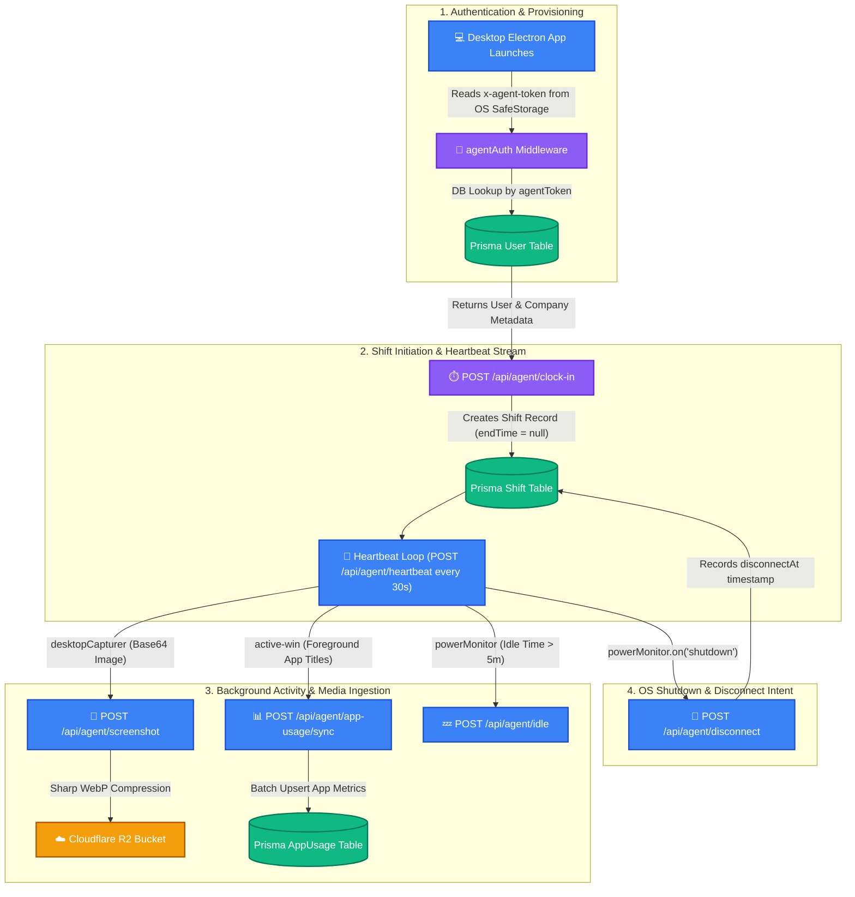

# 🔌 Trace 1.0 - Backend & Desktop Agent Interconnection in Depth

This document explains the **exact deep technical interconnection** between the **Electron Desktop Agent App** (running on employee machines) and the **Express Node.js Backend**.

---

## 📊 1. Vertical Interconnection Flowchart



---

## 🔌 2. The 5 Core Interconnection Pipelines

### 1. Token Provisioning & OS Keychain Storage Pipeline
* When an Admin creates an Employee on the Dashboard, backend generates a unique 32-byte hex `agentToken` stored in `User.agentToken`.
* When Employee logs into the Desktop App, the token is stored in the operating system's native secure storage (`electron.safeStorage` or Windows Credential Manager / Mac Keychain).
* **Header Injection:** Every outgoing Axios/HTTP request from Electron attaches:
  `headers: { 'x-agent-token': token }`

---

### 2. Shift Synchronization Pipeline (`clock-in` / `clock-out`)
* **State Sync:** The Desktop App maintains a local State (`isWorking: boolean`, `currentShiftId: string`).
* **Start Shift:** Calling `POST /api/agent/clock-in` creates a `Shift` row in PostgreSQL with `endTime: null`. The response returns `{ shiftId }` which the desktop app holds in memory.
* **Stop Shift:** Clicking "Stop Work" calls `POST /api/agent/clock-out` which calculates `totalWorkSecs` and `totalActiveSecs`.

---

### 3. Background Monitoring & Media Ingestion Pipeline

#### A. Screenshots Pipeline
1. Electron native API `desktopCapturer.getSources({ types: ['screen'] })` takes a raw PNG buffer.
2. App converts buffer to Base64 string and calls `POST /api/agent/screenshot`.
3. Express server receives Base64 $\rightarrow$ `compressToWebP()` (reduces 1MB to 80KB) $\rightarrow$ uploads to **Cloudflare R2** $\rightarrow$ saves metadata record in Postgres.

#### B. Active App & Window Title Tracking Pipeline
1. Electron uses OS-level native bindings (`active-win`) to query the active foreground window every 5 seconds (e.g. `VS Code - index.ts`, `Chrome - Stack Overflow`).
2. App aggregates window usage in local memory.
3. Every 60 seconds, app sends a batch payload to `POST /api/agent/app-usage/sync`.

#### C. Idle Detection Pipeline
1. Electron native `powerMonitor.getSystemIdleTime()` monitors mouse/keyboard inactivity.
2. If idle time exceeds 5 minutes (300s), Desktop App sends `POST /api/agent/idle` to mark the shift as idle.

---

### 4. Offline Resilience Buffer Pipeline (Wi-Fi Failure Handling)

What happens if an employee is working on a laptop while traveling and Wi-Fi disconnects?

```
[WiFi Disconnected] 
  ---> Electron App catches network error
  ---> Saves Screenshots & App Usage locally in SQLite / NeDB / JSON on Disk
  ---> Keeps local shift timer running

[WiFi Reconnected]
  ---> Electron catches 'online' event
  ---> Flushes queued offline buffer to POST /api/agent/app-usage/sync & /screenshot
  ---> Syncs timestamps seamlessly!
```

---

### 5. OS Shutdown & Disconnect Listener Pipeline

If a user shuts down their computer without clicking "Stop Shift":
Electron listens to OS system events before the process is killed:

```javascript
// Electron Main Process
const { powerMonitor, app } = require('electron');

powerMonitor.on('shutdown', async () => {
  // Send quick sync request to backend before OS cuts network
  await api.post('/api/agent/disconnect', {
    reason: 'shutdown',
    disconnectedAt: new Date().toISOString()
  });
});
```

Backend stores `disconnectAt` timestamp on the Shift row. If a power outage occurs and even this listener fails, the **Backend Shift Sweep Cron (`shiftSweep.ts`)** takes over and auto-closes the shift after 90 minutes!

---

## 🎯 Summary Matrix

| Desktop Event | Electron API / Trigger | Backend Route Called | Resulting Action |
| :--- | :--- | :--- | :--- |
| **Login / Boot** | OS SafeStorage | Header validation | Authenticates via `agentAuth.ts` |
| **Start Shift** | User Click / Auto-boot | `POST /api/agent/clock-in` | Shift row created (`endTime = null`) |
| **Keep Alive** | 30s `setInterval` | `POST /api/agent/heartbeat` | Updates `lastHeartbeatAt` |
| **Capture Screen**| `desktopCapturer` | `POST /api/agent/screenshot` | WebP compression & R2 upload |
| **App Tracking** | `active-win` (5s poll) | `POST /api/agent/app-usage/sync` | Batch upsert app metrics |
| **Idle Mouse** | `powerMonitor` (>5m) | `POST /api/agent/idle` | Records idle period |
| **OS Shutdown** | `powerMonitor.on('shutdown')`| `POST /api/agent/disconnect` | Marks `disconnectAt` timestamp |
