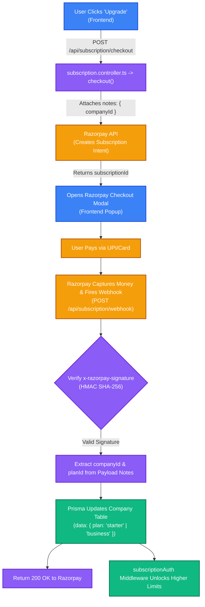

# Payment & Webhooks Architecture

This document outlines the step-by-step payment and subscription architecture implemented in Trace, detailing the flow from a user clicking "Upgrade" to the final database update via the Razorpay Webhook.

## End-to-End Architecture Flowchart

## Security & Verification

The most critical part of this flow is the webhook signature verification. When Razorpay's servers send a success notification to our `POST /api/subscription/webhook` endpoint, it does not carry a standard JWT token.

To prevent malicious users from hitting this endpoint to grant themselves free subscriptions, we verify Razorpay's cryptographic signature. We hash the incoming raw body using our shared `RAZORPAY_WEBHOOK_SECRET`. If the generated HMAC SHA-256 hash matches the `x-razorpay-signature` header, we can guarantee the payload genuinely originated from Razorpay.

## Linking Payments to Tenants

When we initially create the subscription intent in step two, we attach the `companyId` inside the `notes` metadata payload sent to Razorpay. 

When Razorpay fires the webhook back to us after a successful payment, they include this exact `notes` object. This clever pattern allows our backend to immediately identify which company in our database just paid, without needing complex lookup tables or session states. We extract the `companyId`, update the `Company.plan` tier in Prisma, and our authorization middlewares instantly unlock the new features for that tenant.
