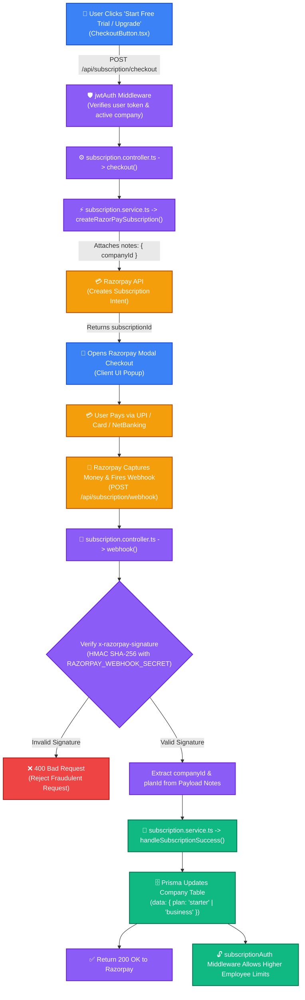

# Complete Trace 1.0 Subscription & Payment Flow (Start to End)

This document explains the **exact step-by-step payment & subscription architecture** implemented in Trace 1.0, from the moment a user clicks the "Upgrade" button on the Frontend to the final Database update via Razorpay Webhook.

---

## 📊 End-to-End Architecture Flowchart



---

## 🛠️ Step-by-Step Code Execution Breakdown

### Step 1: User Initiates Upgrade on Frontend
**File:** `Trace -Frontend/src/components/CheckoutButton.tsx`
* When the user clicks the plan button, the frontend sends a `POST` request to `/api/subscription/checkout` with `{ planType: 'starter' }` and the user's JWT token in the `Authorization` header.

```typescript
const response = await fetch(`${apiUrl}/subscription/checkout`, {
  method: 'POST',
  headers: {
    'Content-Type': 'application/json',
    'Authorization': `Bearer ${localStorage.getItem('token')}`
  },
  body: JSON.stringify({ planType: planName.toLowerCase() })
});

const data = await response.json(); // Gets { subscriptionId: 'sub_xyz123' }
```

---

### Step 2: Backend Handles Checkout Intent
**Files:** 
- `Trace -Backend/src/routes/subscription.routes.ts`
- `Trace -Backend/src/controllers/subscription.controller.ts`
- `Trace -Backend/src/services/subscription.service.ts`

1. **Route Protection:** `router.post('/checkout', jwtAuth, checkout)` checks that the user is logged in.
2. **Controller Logic:** Retrieves `planType` and `companyId` (from `req.user?.companyId`). Maps `planType` to the environment Plan ID (`RAZORPAY_STARTER_PLAN_ID` or `RAZORPAY_BUSINESS_PLAN_ID`).
3. **Service Logic:** Calls Razorpay SDK to create the subscription intent, attaching `companyId` in the `notes` metadata.

```typescript
// subscription.service.ts
export const createRazorPaySubscription = async (planId: string, companyId: string) => {
    const subscription = await rasorpayInstance.subscriptions.create({
        plan_id: planId,
        customer_notify: 1,
        total_count: 12,
        notes: {
            companyId: companyId  // 🔑 Attached so Webhook knows which company paid!
        }
    });

    return subscription.id;
};
```

The server returns `{ subscriptionId }` back to the frontend.

---

### Step 3: Frontend Opens Razorpay Modal
**File:** `Trace -Frontend/src/components/CheckoutButton.tsx`

Using the returned `subscriptionId` and the `NEXT_PUBLIC_RAZORPAY_KEY_ID`, the frontend initializes the Razorpay Checkout Popup:

```typescript
const options = {
  key: process.env.NEXT_PUBLIC_RAZORPAY_KEY_ID,
  subscription_id: data.subscriptionId,
  name: "Trace SaaS",
  description: `Upgrade to ${planName} Plan`,
  handler: function (response: any) {
    alert(`Payment Successful! Razorpay Payment ID: ${response.razorpay_payment_id}`);
  }
};
const rzp = new (window as any).Razorpay(options);
rzp.open();
```

---

### Step 4: Payment Completion & Razorpay Webhook Trigger
* The user enters their payment details inside the popup and pays.
* Razorpay's servers capture the money and immediately send a **server-to-server POST request** to our backend webhook URL:
  `POST /api/subscription/webhook`

> ⚠️ **Note:** This request comes directly from Razorpay's servers (not from the browser), so it **does NOT carry a JWT token**.

---

### Step 5: Webhook Signature Verification & DB Update
**Files:**
- `Trace -Backend/src/controllers/subscription.controller.ts`
- `Trace -Backend/src/services/subscription.service.ts`

#### 1. Security Check (HMAC Signature Verification)
To prevent malicious users from hitting our webhook endpoint and giving themselves free subscriptions, we verify Razorpay's signature:

```typescript
// subscription.controller.ts
export const webhook = async (req: Request, res: Response) => {
    const secret = process.env.RAZORPAY_WEBHOOK_SECRET as string;
    const signature = req.headers['x-razorpay-signature'] as string;
    
    // Hash incoming raw body using shared secret
    const expectedSignature = crypto
        .createHmac('sha256', secret)
        .update(JSON.stringify(req.body))
        .digest('hex');

    // If signature matches, it is 100% verified to be from Razorpay
    if (expectedSignature !== signature) {
        return res.status(400).json({ error: "Invalid signature" });
    }
```

#### 2. Business Logic Execution (Prisma Database Update)
Once verified, we extract `companyId` from the payload's `notes` and update the company's plan in Prisma Postgres:

```typescript
// subscription.service.ts
export const handleSubscriptionSuccess = async (companyId: string, subscriptionId: string, planId: string) => {
    let planTier = "free";
    if (planId === process.env.RAZORPAY_STARTER_PLAN_ID) {
        planTier = "starter";
    } else if (planId === process.env.RAZORPAY_BUSINESS_PLAN_ID) {
        planTier = "business";
    }

    // 💾 DB UPDATE: Upgrade company plan
    const updatedCompany = await prisma.company.update({
        where: { id: companyId },
        data: { plan: planTier }
    });

    return updatedCompany;
};
```

Finally, the backend responds with `200 OK` to inform Razorpay that the notification was processed.

---

### Step 6: Subscription Feature Guarding (Middleware)
**File:** `Trace -Backend/src/middleware/subscriptionAuth.ts`

Now that the company's `plan` in the DB is set to `"starter"` or `"business"`, the subscription middleware unlocks features across the app:

```typescript
// Intercepts requests to enforce limits based on current DB plan
export const checkEmployeeLimit = async (req: Request, res: Response, next: NextFunction) => {
    const company = await prisma.company.findUnique({ where: { id: companyId }, include: { _count: { select: { users: true } } } });
    const currentPlan = company.plan || 'free';
    const limit = PLAN_CONFIG[currentPlan].maxEmp;

    if (company._count.users >= limit) {
        return res.status(403).json({ error: `Limit Reached. Your ${currentPlan} plan only allows ${limit} employees.` });
    }
    next();
};
```

---

## 🔑 Key Summary Matrix

| Stage | Responsibility | Primary File | Input / Trigger | Output / Action |
| :--- | :--- | :--- | :--- | :--- |
| **1. UI Intent** | Frontend | `CheckoutButton.tsx` | User clicks button | Calls `/api/subscription/checkout` |
| **2. Intent Creation** | Backend Controller | `subscription.controller.ts` | POST request with `planType` | Returns `subscriptionId` |
| **3. Modal Render** | Razorpay SDK | `Checkout.js` | `subscriptionId` | User completes payment modal |
| **4. Webhook Capture** | Razorpay Server | Webhook Trigger | Payment Success | `POST /api/subscription/webhook` |
| **5. Verification** | Backend Controller | `subscription.controller.ts` | `x-razorpay-signature` | Validates HMAC SHA-256 |
| **6. DB Update** | Backend Service | `subscription.service.ts` | `companyId` & `planId` | `prisma.company.update({ plan })` |
| **7. Access Enforcement**| Backend Middleware | `subscriptionAuth.ts` | User API request | Allows or blocks action based on plan limit |
