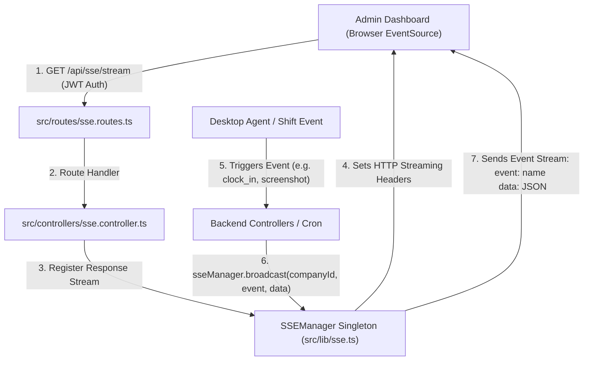

# 📡 Trace 1.0 - Real-Time Server-Sent Events (SSE) Architecture

This document explains the **real-time monitoring system** in Trace 1.0 powered by **Server-Sent Events (SSE)**, including its protocol headers, tenant-scoped broadcasting, memory management, and how it compares to WebSockets and Short Polling.

---

## 📊 1. SSE Connection & Broadcasting Flowchart



---

## ⚡ 2. Theoretical Comparison: SSE vs. WebSockets vs. Polling

| Feature | Short Polling | WebSockets | Server-Sent Events (SSE) [Trace Choice] |
| :--- | :--- | :--- | :--- |
| **Direction** | Client $\rightarrow$ Server | Bidirectional ($\leftrightarrow$) | Unidirectional Server $\rightarrow$ Client ($\rightarrow$) |
| **Protocol** | Standard HTTP | WS / WSS (Upgraded TCP) | Standard HTTP (`text/event-stream`) |
| **HTTP Overhead** | High (New headers every request) | Low (After initial handshake) | Extremely Low (Single open HTTP connection) |
| **Reconnection** | Manual | Manual / Custom Lib | **Built-in Browser Auto-reconnect** |
| **Nginx / Proxy Friendly** | Yes | Needs special proxy setup | Yes (`X-Accel-Buffering: no`) |
| **Best Use Case** | Low frequency updates | Chat apps, Multiplayer games | **Live Dashboards, Activity Monitors, Notifications** |

---

## 🛠️ 3. How SSE Works Under the Hood (Protocol & Headers)

Unlike standard JSON endpoints that send a response and immediately close the HTTP socket, SSE keeps the TCP connection **OPEN indefinitely**.

### Crucial HTTP Headers Set in `src/lib/sse.ts`:
```typescript
res.writeHead(200, {
  'Content-Type': 'text/event-stream',  // 🔑 Tells browser this is an endless stream
  'Cache-Control': 'no-cache',          // 🔑 Prevents browser or CDN from caching stream
  'Connection': 'keep-alive',           // 🔑 Keeps TCP socket open
  'X-Accel-Buffering': 'no',            // 🔑 Disables Nginx buffering so events reach client instantly!
});
```

### Protocol Formatting Rules:
SSE uses a simple plain-text line-based format ending with **double newlines (`\n\n`)**:
```text
event: shift.clock_in
data: {"userId":"usr_123","userName":"Debjyoti","time":"2026-07-26T20:30:00Z"}

:keepalive

```

---

## 🏢 4. Trace 1.0 Multi-Tenant Memory Architecture (`SSEManager`)

In Trace 1.0, multiple company admins can view their respective dashboards simultaneously. The `SSEManager` class in `src/lib/sse.ts` uses an in-memory `Map`:

```typescript
private clients: Map<string, SSEClient[]> = new Map(); 
// Key: companyId -> Value: Array of open response connections
```

### Key Features of `SSEManager`:

1. **Tenant-Scoped Broadcasting (`broadcast`):**
   When Employee X in Company A clocks in, `sseManager.broadcast('companyA', 'shift.clock_in', payload)` only sends data to Company A's admins. Company B receives **ZERO** data!

2. **Keep-Alive Heartbeat (30-Second Interval):**
   Proxies, routers, and cloud platforms (like AWS ALB or Cloudflare) drop idle HTTP connections after 60 seconds. To prevent drops, `SSEManager` sends a lightweight comment `:keepalive\n\n` every 30 seconds:
   ```typescript
   setInterval(() => {
     this.clients.forEach(clients => {
       clients.forEach(client => client.res.write(':keepalive\n\n'));
     });
   }, 30_000);
   ```

3. **Automatic Connection Cleanup:**
   When an admin closes their browser tab, Express fires the `close` event. `SSEManager` catches this and immediately purges the dead socket from memory to prevent memory leaks:
   ```typescript
   res.on('close', () => {
     this.removeClient(clientId);
   });
   ```

---

## 🎯 5. Real-Time Events Handled in Trace 1.0

| Event Name | Trigger | Dashboard Action |
| :--- | :--- | :--- |
| `connected` | Initial SSE Handshake | Displays "Live Connection Active" indicator |
| `shift.clock_in` | Agent starts shift | User status badge changes to **Green (Active)** |
| `shift.clock_out` | Agent stops shift / Shift Sweep | User status badge changes to **Grey (Offline)** |
| `heartbeat` | Agent 30s ping | Updates "Last Active" timestamp |
| `screenshot.captured` | Agent uploads screenshot | Instantly prepends new thumbnail to Admin Feed |
