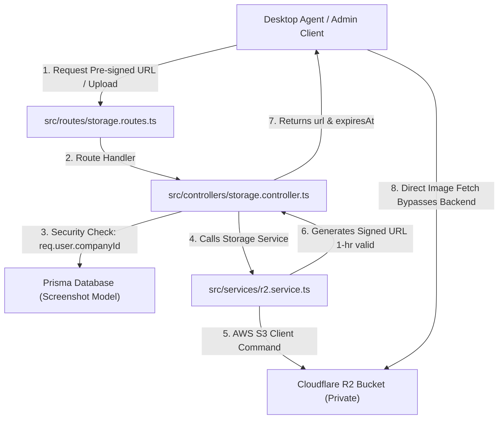

# 📦 Trace 1.0 - Storage Architecture & Private Caching Strategy

This document provides a deep dive into the **Cloudflare R2 Object Storage Architecture**, file interconnectivity, trade-offs of private vs. public storage, and the **Client-Side Expiry Caching Pattern (`expiresAt`)**.

---

## 🔗 1. Simple Interconnectivity Flow Diagram



---

## 📂 2. File Roles & Interconnection

| File Path | Role & Responsibilities |
| :--- | :--- |
| `src/routes/storage.routes.ts` | **Router Gatekeeper:** Registers storage endpoints (`/status`, `/screenshot/:id/url`) and enforces `jwtAuth`. |
| `src/controllers/storage.controller.ts` | **Business & Security Guard:** Verifies `companyId` matching via Prisma DB so Company A cannot access Company B's screenshots. |
| `src/services/r2.service.ts` | **S3 Engine & Image Processor:** Initializes `@aws-sdk/client-s3`, compresses images to WebP via `sharp`, builds deterministic key paths, and generates Pre-signed URLs. |
| `src/lib/prisma.ts` | **Database Layer:** Manages `Screenshot` metadata records (`storageKey`, `storageType`, `companyId`). |

---

## 🔒 3. Private URL Concept & Pre-Signed URLs

### Why do we need Private Buckets?
Trace is a **Multi-Tenant SaaS**. Company A (e.g. Acme Corp) and Company B (e.g. Globex Corp) both store employee screenshots in the system.
* **If Bucket was Public:** Screenshots would have public URLs like `https://pub.r2.dev/screenshots/companyA/user1/120000.webp`. Anyone who guesses or brute-forces the link could view sensitive employee screens!
* **If Bucket is Private:** Nobody on the internet can read or download any file directly from the R2 bucket without a valid cryptographic signature.

---

## ⚖️ 4. Storage Architecture Trade-offs & Engineering Decisions

When serving private images to users, there are **3 possible approaches**. Here is why we chose **Pre-Signed URLs**:

```
Approach 1: Express Server Proxying (BAD for Scale ❌)
Client  --->  Express Server  --->  Reads R2 Bucket  --->  Streams to Client
Drawback: Consumes heavy Server CPU, RAM, and double Bandwidth. Server becomes a bottleneck.

Approach 2: Public Bucket (BAD for Security ❌)
Client  --->  Direct Public R2 URL
Drawback: Zero security. Anyone can view competitor's private screenshots.

Approach 3: Pre-Signed URLs (OUR CHOICE ✅)
Client  --->  Express (Verifies Auth)  --->  Generates 1-Hr Temporary Signed Link
Client  --->  Directly downloads from Cloudflare R2 (Bypassing Express Server CPU!)
```

### Why Pre-Signed URLs win:
1. **Security:** Bucket stays 100% private.
2. **Server Performance:** Express server only generates a lightweight string signature (~1ms). The actual heavy image data (MBs) flows directly between Cloudflare R2 and the user's browser!

---

## ⚡ 5. Client-Side Expiry Caching Pattern (`expiresAt`)

### Beyond Redis & Next.js Cache: What is Client-Side Expiry Caching?

Most developers know about **Redis Cache** (server-side key-value cache) or **Next.js Data Cache**. But serving media files introduces a unique challenge:
> *"If a Pre-Signed URL expires in 1 hour, does the frontend need to call `/api/storage/screenshot/:id/url` every single time a page re-renders?"*

**NO!** That would flood our backend with thousands of API calls just to ask for the same URL.

### How the `expiresAt` Pattern Works:

1. **Backend Response:**
   When the backend generates a Pre-signed URL valid for 3600 seconds (1 hour), it calculates an explicit UTC timestamp (`expiresAt`):
   ```json
   {
     "url": "https://<accountId>.r2.cloudflarestorage.com/screenshots/...?X-Amz-Signature=...",
     "expiresAt": "2026-07-26T21:25:29.000Z",
     "storageType": "r2"
   }
   ```

2. **Frontend Caching Logic (SWR / TanStack Query / React State / LocalStorage):**
   The Frontend stores both `url` and `expiresAt` in its state/cache:

   ```typescript
   // Frontend pseudo-code logic
   async function getCachedScreenshotUrl(screenshotId: string) {
     const cached = cache.get(screenshotId);

     // Check if cache exists AND current time is BEFORE expiresAt (with a 5-minute safety buffer)
     if (cached && new Date(cached.expiresAt).getTime() - Date.now() > 5 * 60 * 1000) {
       return cached.url; // ✅ Instant load from frontend memory! No API call needed!
     }

     // ❌ Cache missing or expired -> Re-fetch new pre-signed URL from Backend
     const res = await fetch(`/api/storage/screenshot/${screenshotId}/url`);
     const data = await res.json();
     
     cache.set(screenshotId, data);
     return data.url;
   }
   ```

### Benefits of `expiresAt` Caching:
* **Zero Backend Overhead:** Re-rendering dashboard components requires **0 database queries** and **0 S3 SDK calls** as long as `Date.now() < expiresAt`.
* **Zero Stale Image Bugs:** Once the 1-hour timestamp expires, the frontend automatically fetches a fresh signed URL without throwing 403 Access Denied errors to the user.
