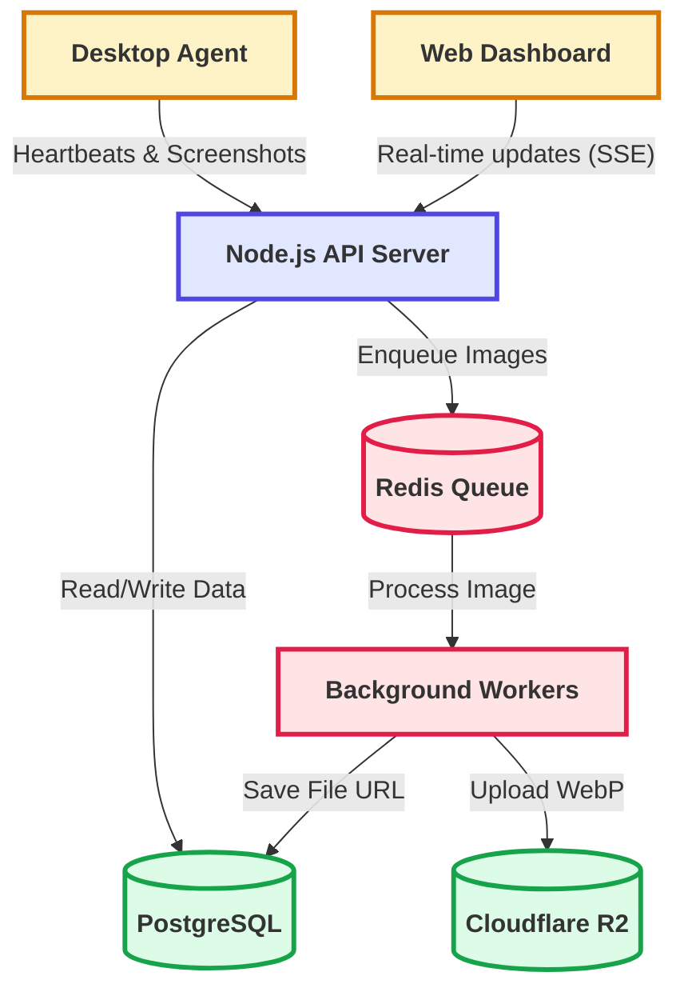

# Architecture Overview

This document provides a high-level view of how the different components of Trace interact to form a cohesive, scalable system. 

## Full System Architecture

Trace is divided into three primary layers: the Client Layer, the Gateway/API Layer, and the Data/Infrastructure Layer. 

## Metrics and Scalability

Our backend is containerized using a multi-stage Docker build (node:20-alpine) and runs on Render. It is designed to handle high concurrency, primarily driven by thousands of desktop agents sending periodic heartbeats and screenshot payloads.

Based on our load testing benchmarks, the system maintains excellent stability even at a scale of over 1.1 million database records. 
* **Throughput:** Supported sustained load tests of 30 Virtual Users generating continuous multi-table SQL aggregations.
* **Latency:** By implementing composite B-Tree indexes and Upstash Redis response caching, we reduced p95 query latency from 50+ seconds down to under 3.5 seconds for complex dashboard statistics.
* **Background Processing:** Pushing image compression (Sharp WebP) to BullMQ asynchronous workers keeps the main event loop free. Our endpoints acknowledge screenshot uploads in less than 5ms, while the actual processing completes in the background.

This decoupled architecture ensures that spikes in agent activity do not degrade the experience for administrators viewing the web dashboard.
