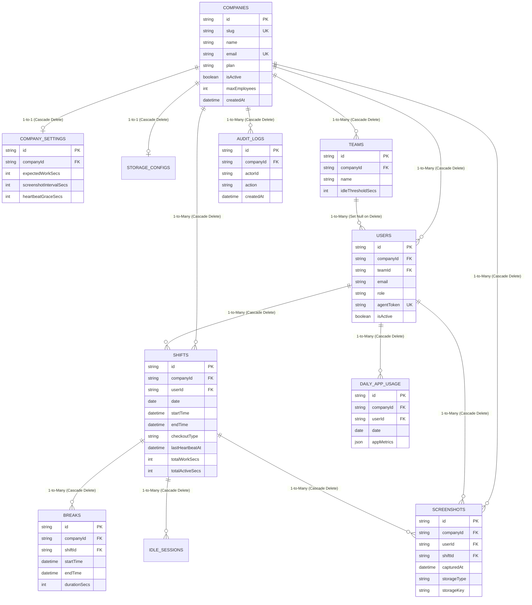

# Database Schema & Relational Model Architecture

This document provides a structural breakdown of the PostgreSQL Multi-Tenant Database Schema, detailing table entities, foreign key relationships, cascade behaviors, and indexing strategies.

## Full Entity-Relationship Diagram (ERD)



## Core Relational Hierarchy

The database follows a strict 3-tier hierarchy:
`Company (Tenant Root) -> Teams (Department Grouping) -> Users (Employees/Admins)`

This hierarchical design simplifies querying and access control. Every table below `Companies` includes a `companyId` foreign key, making it trivial to scope queries and enforce multi-tenancy.

## Database Integrity & Cascade Deletes

To prevent "orphan" records and maintain data cleanliness, the Prisma schema uses explicit referential integrity actions:

* **Cascade Delete (`onDelete: Cascade`):** When a parent record is deleted, PostgreSQL automatically purges all child records in a single database transaction. For example, deleting a `Company` automatically purges its `CompanySettings`, `Teams`, `Users`, `Shifts`, `Screenshots`, and `AuditLogs`.
* **Set Null (`onDelete: SetNull`):** When a department/team is deleted, we set `User.teamId = null`. We do not delete the employee from the company just because their department was reorganized.

## Performance Indexing Strategy (`@@index`)

Querying millions of screenshots or shift records without indexes causes full table scans, resulting in severe performance degradation. Trace relies on targeted composite indexes to ensure snappy dashboard load times:

```prisma
// Fast Daily Dashboard Queries (e.g. Get today's shifts for Company X)
@@index([companyId, date])

// Fast User Activity Timeline (e.g. Get User Y's screenshots for Date Z)
@@index([userId, capturedAt])
@@index([companyId, capturedAt])

// Fast Multi-Tenant Composite Unique Key
@@unique([companyId, email]) // The same email can register under different companies
```
